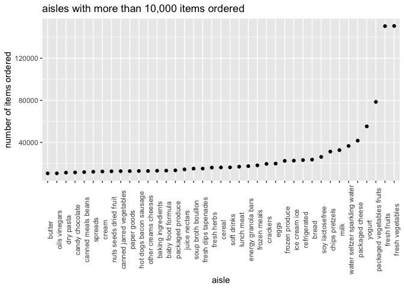
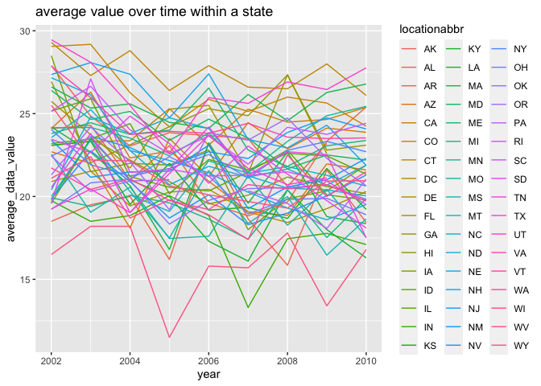
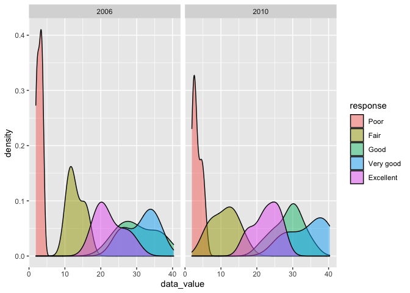
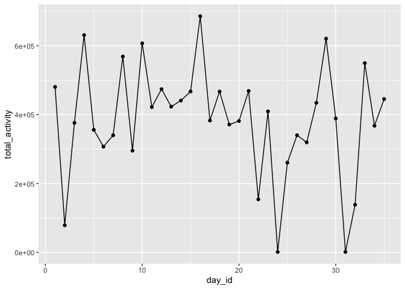
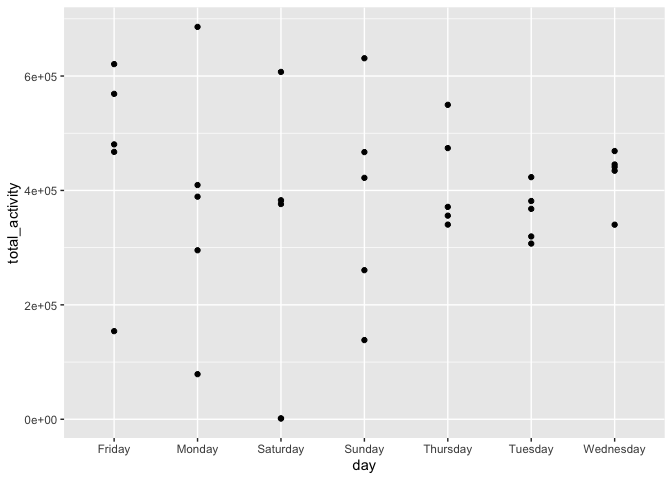
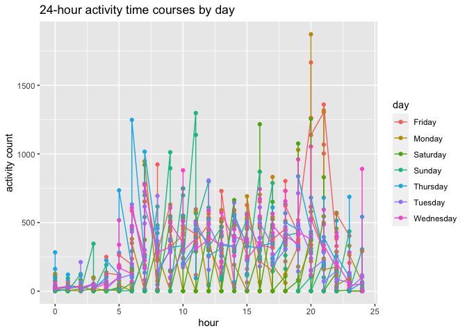

p8105\_hw3\_wc2788
================
Wen Cheng
10/17/2021

## Problem 1

load the data from p8105.datasets

``` r
library(p8105.datasets)
data("instacart")
```

This dataset contains 1384617 rows and 15 columns, where each row in the
dataset is a product from an order. There are order\_id, product\_id,
user id, aisle id and product names.

How many aisles are there, and which aisles are the most items ordered
from?

``` r
instacart %>% 
  count(aisle) %>% #count how many aisles
  arrange(desc(n)) #find the most items ordered
```

    ## # A tibble: 134 × 2
    ##    aisle                              n
    ##    <chr>                          <int>
    ##  1 fresh vegetables              150609
    ##  2 fresh fruits                  150473
    ##  3 packaged vegetables fruits     78493
    ##  4 yogurt                         55240
    ##  5 packaged cheese                41699
    ##  6 water seltzer sparkling water  36617
    ##  7 milk                           32644
    ##  8 chips pretzels                 31269
    ##  9 soy lactosefree                26240
    ## 10 bread                          23635
    ## # … with 124 more rows

There are 134 aisles, and fresh vegetables are most ordered.

Make a plot that shows the number of items ordered in each aisle,
limiting this to aisles with more than 10000 items ordered. Arrange
aisles sensibly, and organize your plot so others can read it.

``` r
instacart %>% 
  count(aisle) %>% 
  filter(n > 10000) %>% #only show more than 10000
  mutate(aisle = factor(aisle), 
         aisle = fct_reorder(aisle, n)) %>% 
  ggplot(aes(x = aisle, y = n)) + 
  geom_point() + 
  theme(axis.text.x = element_text(angle = 90)) + #easy to read
  labs(title = "aisles with more than 10,000 items ordered",
       x = "aisle",
       y = "number of items ordered") #clear named
```

<!-- -->
only fresh vegetables and fresh fruits ordered more than 120000 items.

Make a table showing the three most popular items in each of the aisles
“baking ingredients”, “dog food care”, and “packaged vegetables fruits”.
Include the number of times each item is ordered in your table.

``` r
instacart %>%
  filter(aisle %in% c("baking ingredients", "dog food care", "packaged vegetables fruits")) %>% #select aisles
  group_by(aisle) %>%
  count(product_name) %>%
  mutate(rank = min_rank(desc(n))) %>% #make a rank variable
  filter(rank <= 3) %>% #most popular three
  arrange(aisle, rank) %>%
  knitr::kable() #make a table
```

| aisle                      | product\_name                                 |    n | rank |
|:---------------------------|:----------------------------------------------|-----:|-----:|
| baking ingredients         | Light Brown Sugar                             |  499 |    1 |
| baking ingredients         | Pure Baking Soda                              |  387 |    2 |
| baking ingredients         | Cane Sugar                                    |  336 |    3 |
| dog food care              | Snack Sticks Chicken & Rice Recipe Dog Treats |   30 |    1 |
| dog food care              | Organix Chicken & Brown Rice Recipe           |   28 |    2 |
| dog food care              | Small Dog Biscuits                            |   26 |    3 |
| packaged vegetables fruits | Organic Baby Spinach                          | 9784 |    1 |
| packaged vegetables fruits | Organic Raspberries                           | 5546 |    2 |
| packaged vegetables fruits | Organic Blueberries                           | 4966 |    3 |

organic baby spinach is the most ordered packaged vegetables, it ordered
9784 times.

Make a table showing the mean hour of the day at which Pink Lady Apples
and Coffee Ice Cream are ordered on each day of the week; format this
table for human readers (i.e. produce a 2 x 7 table)

``` r
instacart %>%
  filter(product_name %in% c("Pink Lady Apples","Coffee Ice Cream")) %>% #select two prodcuts
  group_by(product_name, order_dow) %>%
  summarize(mean_hour = mean(order_hour_of_day)) %>% #find the mean of order hour
  pivot_wider(names_from = order_dow,
              values_from = mean_hour) %>% #widen data
  knitr::kable()
```

    ## `summarise()` has grouped output by 'product_name'. You can override using the `.groups` argument.

| product\_name    |        0 |        1 |        2 |        3 |        4 |        5 |        6 |
|:-----------------|---------:|---------:|---------:|---------:|---------:|---------:|---------:|
| Coffee Ice Cream | 13.77419 | 14.31579 | 15.38095 | 15.31818 | 15.21739 | 12.26316 | 13.83333 |
| Pink Lady Apples | 13.44118 | 11.36000 | 11.70213 | 14.25000 | 11.55172 | 12.78431 | 11.93750 |

``` r
#not sure how to change 0-6 to monday to sunday
```

people mostly order pink lady apples and coffee ice cream from 11am to
3pm. \#\# Problem 2 load the data

``` r
library(p8105.datasets)
data("brfss_smart2010") 
```

The dataset contains 134203 rows and 23 columns. There contain
information on location, topic, question, response.

clean the data

``` r
brfss = 
  brfss_smart2010 %>%
  janitor::clean_names()  %>% #format the data
  filter(topic == "Overall Health") %>% #focus on the “Overall Health” topic
  filter(response == "Excellent" | response == "Very good" | response == "Good" | response == "Fair" | response == "Poor") %>% #include only responses from “Excellent” to “Poor”
  mutate(response = fct_relevel(response, "Poor", "Fair", "Good", "Very good", "Excellent")) #taking levels ordered
```

In 2002, which states were observed at 7 or more locations? What about
in 2010?

``` r
brfss %>%
  filter(year == 2002) %>% #in year 2002
  group_by(year, locationabbr) %>%
  distinct(locationdesc) %>% 
  summarize(total_testing_location = n()) %>% #count location
  filter(total_testing_location >= 7) %>% #at 7 or more
  arrange(total_testing_location) %>%
  knitr::kable() #make a table
```

    ## `summarise()` has grouped output by 'year'. You can override using the `.groups` argument.

| year | locationabbr | total\_testing\_location |
|-----:|:-------------|-------------------------:|
| 2002 | CT           |                        7 |
| 2002 | FL           |                        7 |
| 2002 | NC           |                        7 |
| 2002 | MA           |                        8 |
| 2002 | NJ           |                        8 |
| 2002 | PA           |                       10 |

``` r
brfss %>%
  filter(year == 2010) %>% #in year 2010
  group_by(year, locationabbr) %>%
  distinct(locationdesc) %>%
  summarize(total_testing_location = n()) %>% #count location
  filter(total_testing_location >= 7) %>% #at 7 or more
  arrange(total_testing_location) %>%
  knitr::kable() #make a table
```

    ## `summarise()` has grouped output by 'year'. You can override using the `.groups` argument.

| year | locationabbr | total\_testing\_location |
|-----:|:-------------|-------------------------:|
| 2010 | CO           |                        7 |
| 2010 | PA           |                        7 |
| 2010 | SC           |                        7 |
| 2010 | OH           |                        8 |
| 2010 | MA           |                        9 |
| 2010 | NY           |                        9 |
| 2010 | NE           |                       10 |
| 2010 | WA           |                       10 |
| 2010 | CA           |                       12 |
| 2010 | MD           |                       12 |
| 2010 | NC           |                       12 |
| 2010 | TX           |                       16 |
| 2010 | NJ           |                       19 |
| 2010 | FL           |                       41 |

Construct a dataset that is limited to Excellent responses, and
contains, year, state, and a variable that averages the data\_value
across locations within a state. Make a “spaghetti” plot of this average
value over time within a state (that is, make a plot showing a line for
each state across years – the geom\_line geometry and group aesthetic
will help).

``` r
brfss %>%
  filter(response == "Excellent") %>% #only excellent responses
  group_by(year, locationabbr) %>% #contains year and state
  mutate(average_data_value = mean(data_value)) %>% #add a variable that averages the data_value
  ggplot(aes(x = year, y = average_data_value, 
             group = locationabbr, #group by state
             color = locationabbr)) + #color the line
  geom_line() + #make a spaghetti plot
  labs(title = "average value over time within a state")
```

    ## Warning: Removed 65 row(s) containing missing values (geom_path).

<!-- -->

Make a two-panel plot showing, for the years 2006, and 2010,
distribution of data\_value for responses (“Poor” to “Excellent”) among
locations in NY State.

``` r
brfss %>%
  filter(year == 2006 | year == 2010) %>% #for year 2006 and 2010
  filter(locationabbr == "NY") %>% #in NY state
  ggplot(aes(x = data_value, fill = response)) +
  geom_density(alpha = 0.5) + #make a density plot
  facet_wrap(~ year) #create a two-panel plot
```

<!-- -->

## Problem 3

load,tidy and wrangle the data

``` r
library(readr)
accel_data = read_csv("accel_data.csv") %>%
  janitor::clean_names() %>%
  mutate(weekday_vs_weekend = ifelse(day %in% c("Saturday", "Sunday"),"weekend", "weekday")) %>% # add weekday vs weekend variable
  relocate(weekday_vs_weekend) %>% #move this variable to front
  pivot_longer(
    activity_1:activity_1440,
    names_to = "activity_minute",
    names_prefix = "activity_",
    values_to = "activity_count") #longthen the table
```

    ## Rows: 35 Columns: 1443

    ## ── Column specification ────────────────────────────────────────────────────────
    ## Delimiter: ","
    ## chr    (1): day
    ## dbl (1442): week, day_id, activity.1, activity.2, activity.3, activity.4, ac...

    ## 
    ## ℹ Use `spec()` to retrieve the full column specification for this data.
    ## ℹ Specify the column types or set `show_col_types = FALSE` to quiet this message.

``` r
 # mutate(day = fct_relevel(day, "Monday", "Tuesday", "Wednesday", "Thursday", "Friday", "Saturday", "Sunday")) 

accel_data
```

    ## # A tibble: 50,400 × 6
    ##    weekday_vs_weekend  week day_id day    activity_minute activity_count
    ##    <chr>              <dbl>  <dbl> <chr>  <chr>                    <dbl>
    ##  1 weekday                1      1 Friday 1                         88.4
    ##  2 weekday                1      1 Friday 2                         82.2
    ##  3 weekday                1      1 Friday 3                         64.4
    ##  4 weekday                1      1 Friday 4                         70.0
    ##  5 weekday                1      1 Friday 5                         75.0
    ##  6 weekday                1      1 Friday 6                         66.3
    ##  7 weekday                1      1 Friday 7                         53.8
    ##  8 weekday                1      1 Friday 8                         47.8
    ##  9 weekday                1      1 Friday 9                         55.5
    ## 10 weekday                1      1 Friday 10                        43.0
    ## # … with 50,390 more rows

There are 50400 rows and 6 columns in this accelerometer dataset.
Columns include week number, day\_id, day, activity minutes and activity
count, and variable weekday\_vs\_weekend that has been added to
distinguish weekends from weekdays. These variables reveal the trends of
daily activity counts for a 63 year-old male with BMI 25 in five weeks.

aggregate accross minutes to create a total activity variable for each
day, and create a table showing these totals.

``` r
daily_total_activity = accel_data %>%
  group_by(week, day, day_id) %>% #for each day and show the week number
  summarise(total_activity = sum(activity_count)) #sum each minute activity count
```

    ## `summarise()` has grouped output by 'week', 'day'. You can override using the `.groups` argument.

``` r
  knitr::kable(daily_total_activity) #make a table
```

| week | day       | day\_id | total\_activity |
|-----:|:----------|--------:|----------------:|
|    1 | Friday    |       1 |       480542.62 |
|    1 | Monday    |       2 |        78828.07 |
|    1 | Saturday  |       3 |       376254.00 |
|    1 | Sunday    |       4 |       631105.00 |
|    1 | Thursday  |       5 |       355923.64 |
|    1 | Tuesday   |       6 |       307094.24 |
|    1 | Wednesday |       7 |       340115.01 |
|    2 | Friday    |       8 |       568839.00 |
|    2 | Monday    |       9 |       295431.00 |
|    2 | Saturday  |      10 |       607175.00 |
|    2 | Sunday    |      11 |       422018.00 |
|    2 | Thursday  |      12 |       474048.00 |
|    2 | Tuesday   |      13 |       423245.00 |
|    2 | Wednesday |      14 |       440962.00 |
|    3 | Friday    |      15 |       467420.00 |
|    3 | Monday    |      16 |       685910.00 |
|    3 | Saturday  |      17 |       382928.00 |
|    3 | Sunday    |      18 |       467052.00 |
|    3 | Thursday  |      19 |       371230.00 |
|    3 | Tuesday   |      20 |       381507.00 |
|    3 | Wednesday |      21 |       468869.00 |
|    4 | Friday    |      22 |       154049.00 |
|    4 | Monday    |      23 |       409450.00 |
|    4 | Saturday  |      24 |         1440.00 |
|    4 | Sunday    |      25 |       260617.00 |
|    4 | Thursday  |      26 |       340291.00 |
|    4 | Tuesday   |      27 |       319568.00 |
|    4 | Wednesday |      28 |       434460.00 |
|    5 | Friday    |      29 |       620860.00 |
|    5 | Monday    |      30 |       389080.00 |
|    5 | Saturday  |      31 |         1440.00 |
|    5 | Sunday    |      32 |       138421.00 |
|    5 | Thursday  |      33 |       549658.00 |
|    5 | Tuesday   |      34 |       367824.00 |
|    5 | Wednesday |      35 |       445366.00 |

``` r
#make a plot to see the trend
  ggplot(daily_total_activity, aes(x = day_id, y = total_activity)) +
  geom_line() + geom_point() #show trend by day_id
```

<!-- -->

``` r
  ggplot(daily_total_activity, aes(x = day, y = total_activity)) +
  geom_point() #show trend by Monday to Sunday
```

<!-- -->
didn’t see any obvious trend. He has lowest activity count(1440) on
Saturday in week 4 and 5. On Tuesday and Wednesday, he has similar
activity count in these 5 weeks.

Make a single-panel plot that shows the 24-hour activity time courses
for each day and use color to indicate day of the week

``` r
accel_data %>%
  mutate(activity_minute = as.numeric(activity_minute), #let minute be numeric
         hour = activity_minute %/% 60, #convert minute by hour
         hour = as.integer(hour)) %>% #let hour be integer
  group_by(day_id, day, hour) %>%
  summarize(
    hour_activity = mean(activity_count)
  ) %>%
  ggplot(aes(x = hour, y = hour_activity, color = day)) +
  geom_point() +
  geom_line(alpha = 0.8) +
  labs(
    title = "24-hour activity time courses by day for 5 weeks",
    x = "hour",
    y = "activity count"
  ) +
  scale_x_continuous(
    breaks = c(0:24) # a day have 24 hours
  ) 
```

    ## `summarise()` has grouped output by 'day_id', 'day'. You can override using the `.groups` argument.

<!-- --> he
is less active at 12am-4am.
